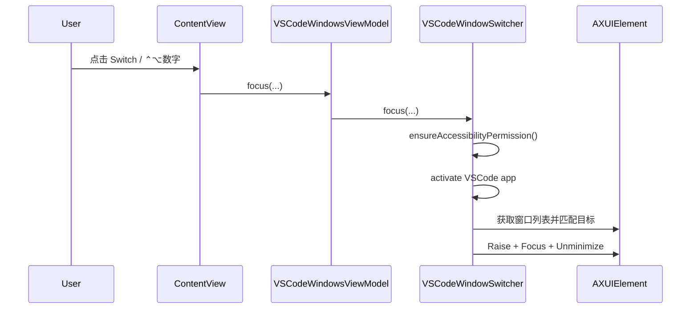

# 架构设计

## 总体架构

```mermaid
flowchart TD
    UI[SwiftUI ContentView] --> VM[VSCodeWindowsViewModel]
    VM --> SW[VSCodeWindowSwitcher]
    HK[HotKeyManager(Carbon)] --> AD[AppDelegate]
    AD --> SW
    SW --> AX[Accessibility API / AXUIElement]
    SW --> WK[AppKit / NSRunningApplication]
```

## 技术栈
- **客户端:** SwiftUI（macOS App）
- **系统接口:** AppKit / ApplicationServices（Accessibility）/ Carbon HotKey
- **存储:** UserDefaults（窗口编号映射）

## 核心流程



## 重大架构决策

本项目优先在每次变更的 `how.md` 中记录 ADR；此处仅保留索引入口（暂无）。

| adr_id | title | date | status | affected_modules | details |
|--------|-------|------|--------|------------------|---------|
| ADR-001 | 使用 Accessibility API 枚举与聚焦 VSCode 窗口 | 2026-01-10 | ✅已采纳 | VSCode-Switcher | `../history/2026-01/202601101047_vscode_window_list_switch/how.md#adr-001-使用-accessibility-api-枚举与聚焦-vscode-窗口` |
